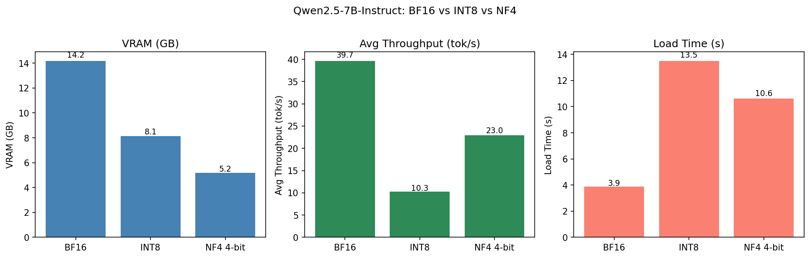

# Qwen2.5-7B-Instruct Quantization Benchmark

Benchmarking **BF16 vs INT8 vs NF4 4-bit** quantization on a single NVIDIA RTX A6000 (47.4 GB VRAM), using [bitsandbytes](https://github.com/bitsandbytes-foundation/bitsandbytes) for post-training quantization.

---

## Results



| Precision | VRAM (GB) | Avg Throughput (tok/s) | Load Time (s) |
|-----------|----------:|----------------------:|-------------:|
| BF16      | 14.19     | 39.7                  | 3.9          |
| INT8      | 8.12      | 10.3                  | 13.5         |
| NF4 4-bit | 5.19      | 23.0                  | 10.6         |

*Tested on 3 prompts, 200 new tokens each, greedy decoding (`do_sample=False`).*

---

## Setup

```bash
# Install dependencies
pip install transformers accelerate bitsandbytes pandas matplotlib

# Run benchmark
cd Quantization
python benchmark.py
```

Results are saved to `results/results.json` and `results/benchmark_results.png`.

---

## Project Structure

```
Quantization/
├── benchmark.py       # Main entry point
├── models.py          # BF16 / INT8 / NF4 model loaders
├── utils.py           # Inference timing, VRAM measurement, plotting
├── quantization.ipynb # Interactive exploration notebook
└── results/
    ├── results.json
    └── benchmark_results.png
```

---

## Key Observations

### 1. Output quality is largely preserved after quantization

All three precision levels produced semantically coherent and factually consistent answers to all prompts.

A representative comparison for the prompt *"Explain neural network quantization in simple terms"*:

| Precision | Response excerpt |
|-----------|-----------------|
| BF16      | "...without significantly compromising their **performance**..." |
| INT8      | "...without significantly **reducing** their performance..."    |
| NF4 4-bit | "...without significantly compromising their **accuracy**..."   |

The wording varies slightly, but the meaning is identical. This indicates that quantization introduces tiny data errors into each weight, and these errors can occasionally change the highest-ranking token. No semantic degradation was observed in any of the 9 inference runs.

### 2. Why is INT8 *slower* than NF4 — despite being higher precision?

This is counterintuitive and worth explaining:

**bitsandbytes LLM.int8() (INT8)** uses *mixed-precision decomposition*:
- It detects outlier weight columns (typically ~0.1% of columns) and keeps those in FP16.
- The remaining columns are quantized to INT8.
- Every matrix multiplication therefore involves a branching operation: split input, run two separate GEMMs, add results back together.
- This overhead is significant on modern CUDA hardware optimised for dense, uniform operations.

**bitsandbytes NF4 (4-bit)** with `bnb_4bit_compute_dtype=bfloat16`:
- Weights are stored at 4-bit but **dequantized to BF16 before each matrix multiplication**.
- The actual compute is a standard, dense BF16 GEMM — which benefits from A6000's full BF16 tensor core throughput.
- No branching, no mixed paths.

In INT8, bitsandbytes handles the outlier part separately with higher precision, introducing additional branches, memory accesses, and kernel scheduling; while NF4 has lower weights and a more direct path. Therefore, the running speed is: BF16 > INT8 > NF4.

---

## Next Steps

- [ ] **Add Perplexity evaluation** — run on WikiText-2 to quantify accuracy loss beyond qualitative comparison
- [ ] **GPTQ quantization** — weight-only PTQ with calibration data, often better quality than bitsandbytes at the same bit-width
- [ ] **AWQ (Activation-aware Weight Quantization)** — state-of-the-art 4-bit PTQ, preserves outlier channels explicitly
- [ ] **vLLM integration** — vLLM supports GPTQ/AWQ/FP8 natively and provides production-grade continuous batching; expected to give significantly higher throughput than the single-request bitsandbytes baseline measured here
- [ ] **Batch size scaling** — repeat the benchmark at batch sizes 1 / 4 / 8 / 16 to see how throughput scales per precision
- [ ] **FP8 (H100/A100)** — FP8 is hardware-native on Hopper and Ampere-next GPUs; no A6000 support but worth noting for future hardware

---

## Hardware

| | |
|---|---|
| GPU | NVIDIA RTX A6000 |
| VRAM | 47.4 GB |
| PyTorch | 2.5.1 |
| CUDA | 11.8 |
| transformers | 4.57.6 |
| bitsandbytes | latest |

---

## References

- [QLoRA: Efficient Finetuning of Quantized LLMs](https://arxiv.org/abs/2305.14314) — introduced NF4 and double quantization
- [LLM.int8(): 8-bit Matrix Multiplication for Transformers at Scale](https://arxiv.org/abs/2208.07339) — bitsandbytes INT8 method
- [GPTQ: Accurate Post-Training Quantization](https://arxiv.org/abs/2210.17323)
- [AWQ: Activation-aware Weight Quantization](https://arxiv.org/abs/2306.00978)
- [vLLM](https://github.com/vllm-project/vllm) — high-throughput LLM serving
